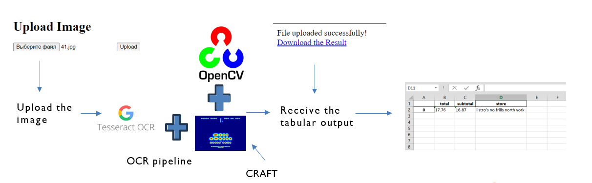

# OCR with Flask Web App

## Abstract
In this project the aim is to extract text information from receipts images. 
The application is wrapped into a simple Flaks app.

## Prerequisites

1. You have to install our Custom_CRAFT package to run the code. This is a modification of original CRAFT package.
2. You have to establish your Open AI key to use GPT API.

## How to run

1. Create venv with this directory
2. Install the requirements from requirements.txt
3. activate venv
4. From terminal run flask app with flask run command.
5. Upload any photo from sample data folder to the website. 
6. wait and download the resulting Excel file

## Methodology
1. Text Region Identification: CRAFT package is used to get the ROI's in the image.
2. Text Extraction: EasyOCR is used for text extraction.
3. Text Analysis with LLM: GPT-4 is used to extract text information from OCR data.
   
Links:
- Original CRAFT: [Link](https://github.com/clovaai/CRAFT-pytorch)
- Custom CRAFT: [Link](https://github.com/Maestro-111/Custom-Craft.git)
- EasyOCR: [Link](https://github.com/JaidedAI/EasyOCR)

## Evaluations

Each time user upload their photo, program stores the resulting table in a folder. 
unit testing.py merges all the outputs into one table and compares it with database.xlsx to log out the errors.

- Evaluation Metrics: Accuracy via using unit testing.py.
- Limitations: Dependency on image quality. Also, the web app is not publicly available.

## TO DO

1. Work on GPT prompt. Not accurate in identifying address.

